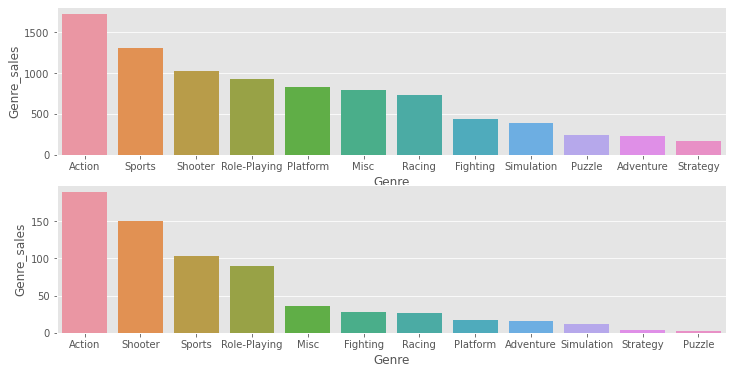
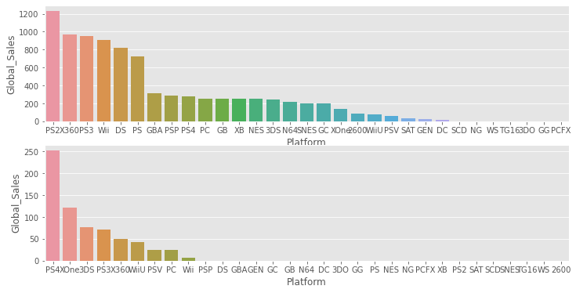
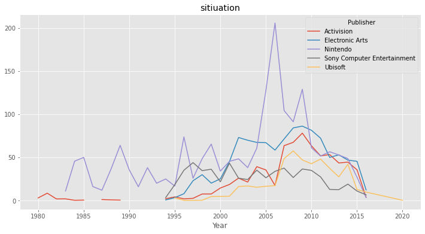

 数据挖掘互评作业三：分类、预测与聚类

 姓名：黄贵宸

 学号：3220200892

# 实验方法与结果

  *  数据说明：选取的数据集为 
    [Video Game Sales](https://www.kaggle.com/gregorut/videogamesales)
  * 前期的数据读入及数据的基础分析：


```python
import pandas as pd
import numpy as np

data_path = 'E:/桌面/dataMining/third/vgsales.csv'
data = pd.read_csv(data_path)
print(data.shape)
data.head()
```

    (16598, 11)


<div>
<style scoped>
    .dataframe tbody tr th:only-of-type {
        vertical-align: middle;
    }

    .dataframe tbody tr th {
        vertical-align: top;
    }
    
    .dataframe thead th {
        text-align: right;
    }
</style>
<table border="1" class="dataframe">
  <thead>
    <tr style="text-align: right;">
      <th></th>
      <th>Rank</th>
      <th>Name</th>
      <th>Platform</th>
      <th>Year</th>
      <th>Genre</th>
      <th>Publisher</th>
      <th>NA_Sales</th>
      <th>EU_Sales</th>
      <th>JP_Sales</th>
      <th>Other_Sales</th>
      <th>Global_Sales</th>
    </tr>
  </thead>
  <tbody>
    <tr>
      <th>0</th>
      <td>1</td>
      <td>Wii Sports</td>
      <td>Wii</td>
      <td>2006.0</td>
      <td>Sports</td>
      <td>Nintendo</td>
      <td>41.49</td>
      <td>29.02</td>
      <td>3.77</td>
      <td>8.46</td>
      <td>82.74</td>
    </tr>
    <tr>
      <th>1</th>
      <td>2</td>
      <td>Super Mario Bros.</td>
      <td>NES</td>
      <td>1985.0</td>
      <td>Platform</td>
      <td>Nintendo</td>
      <td>29.08</td>
      <td>3.58</td>
      <td>6.81</td>
      <td>0.77</td>
      <td>40.24</td>
    </tr>
    <tr>
      <th>2</th>
      <td>3</td>
      <td>Mario Kart Wii</td>
      <td>Wii</td>
      <td>2008.0</td>
      <td>Racing</td>
      <td>Nintendo</td>
      <td>15.85</td>
      <td>12.88</td>
      <td>3.79</td>
      <td>3.31</td>
      <td>35.82</td>
    </tr>
    <tr>
      <th>3</th>
      <td>4</td>
      <td>Wii Sports Resort</td>
      <td>Wii</td>
      <td>2009.0</td>
      <td>Sports</td>
      <td>Nintendo</td>
      <td>15.75</td>
      <td>11.01</td>
      <td>3.28</td>
      <td>2.96</td>
      <td>33.00</td>
    </tr>
    <tr>
      <th>4</th>
      <td>5</td>
      <td>Pokemon Red/Pokemon Blue</td>
      <td>GB</td>
      <td>1996.0</td>
      <td>Role-Playing</td>
      <td>Nintendo</td>
      <td>11.27</td>
      <td>8.89</td>
      <td>10.22</td>
      <td>1.00</td>
      <td>31.37</td>
    </tr>
  </tbody>
</table>
</div>


```python
data.info()
```

    <class 'pandas.core.frame.DataFrame'>
    RangeIndex: 16598 entries, 0 to 16597
    Data columns (total 11 columns):
     #   Column        Non-Null Count  Dtype  
    ---  ------        --------------  -----  
     0   Rank          16598 non-null  int64  
     1   Name          16598 non-null  object 
     2   Platform      16598 non-null  object 
     3   Year          16327 non-null  float64
     4   Genre         16598 non-null  object 
     5   Publisher     16540 non-null  object 
     6   NA_Sales      16598 non-null  float64
     7   EU_Sales      16598 non-null  float64
     8   JP_Sales      16598 non-null  float64
     9   Other_Sales   16598 non-null  float64
     10  Global_Sales  16598 non-null  float64
    dtypes: float64(6), int64(1), object(4)
    memory usage: 1.4+ MB


```python
data.describe(include = 'object').T
```


<div>
<style scoped>
    .dataframe tbody tr th:only-of-type {
        vertical-align: middle;
    }

    .dataframe tbody tr th {
        vertical-align: top;
    }
    
    .dataframe thead th {
        text-align: right;
    }
</style>
<table border="1" class="dataframe">
  <thead>
    <tr style="text-align: right;">
      <th></th>
      <th>count</th>
      <th>unique</th>
      <th>top</th>
      <th>freq</th>
    </tr>
  </thead>
  <tbody>
    <tr>
      <th>Name</th>
      <td>16598</td>
      <td>11493</td>
      <td>Need for Speed: Most Wanted</td>
      <td>12</td>
    </tr>
    <tr>
      <th>Platform</th>
      <td>16598</td>
      <td>31</td>
      <td>DS</td>
      <td>2163</td>
    </tr>
    <tr>
      <th>Genre</th>
      <td>16598</td>
      <td>12</td>
      <td>Action</td>
      <td>3316</td>
    </tr>
    <tr>
      <th>Publisher</th>
      <td>16540</td>
      <td>578</td>
      <td>Electronic Arts</td>
      <td>1351</td>
    </tr>
  </tbody>
</table>
</div>


可以看到有31个游戏平台，12个游戏类型，578个发行商


```python
#对空值数据进行处理
print(data.isnull().sum()[data.isnull().sum()!=0]) #统计空值数据

data1=data.dropna(axis=0,subset = ["Publisher"])  #删除Publisher有缺失的样本

data1=data1.dropna(axis=0,subset = ["Year"])  #删除Year有缺失的样本

data1.index = range(len(data1))  #矫正索引
data1['Rank']=range(1,16292)

data1.to_excel('E:/桌面/dataMining/third/vgsales_new.xls') #保存为新数据
```

    Year         271
    Publisher     58
    dtype: int64


## 一. 电子游戏市场分析

## 1.1 概述

我们用数据集提供的销量信息，通过以下几个角度：游戏的类型、发布平台、发行公司，对电子游戏市场受欢迎的程度进行分析。

## 1.2 实现方法


```python
语言：python
结果：PNG图表
依赖包：matplotlib， pandas， numpy， seaborn
```


```python
import matplotlib.pyplot as plt
import pandas as pd
import numpy as np
import  seaborn as sns
#画图风格
plt.style.use("ggplot")
```

## 1.3 对受欢迎的游戏类型进行分析


```python
FGE=pd.pivot_table(data,index='Year',columns='Genre',values='Global_Sales',aggfunc=np.sum).sum().sort_values(ascending=False)
FGE=pd.DataFrame(data=FGE,columns={'Genre_sales'})
FGE_near5=pd.pivot_table(data,index='Year',columns='Genre',values='Global_Sales',aggfunc=np.sum).iloc[-5:,:].sum().sort_values(ascending=False)
FGE_near5=pd.DataFrame(data=FGE_near5,columns={'Genre_sales'})
fig,(ax1,ax2)=plt.subplots(2,1,figsize=(12,6))
sns.barplot(x=FGE.index,y='Genre_sales',data=FGE,ax=ax1)
sns.barplot(x=FGE_near5.index,y='Genre_sales',data=FGE_near5,ax=ax2)
```


    <AxesSubplot:xlabel='Genre', ylabel='Genre_sales'>


​    

​    


## 1.4 对受欢迎的游戏发布平台进行分析

可以看到自统计（1980）以来和近五年最受欢迎的游戏类型都是动作类型
近五年原本第三的射击类游戏反超了运动类游戏，成为了第二
Platform 和 puzzle类的销量多有所下滑


```python
FPF=pd.pivot_table(data,index='Year',columns='Platform',values='Global_Sales',aggfunc=np.sum).sum().sort_values(ascending=False)
FPF=pd.DataFrame(data=FPF,columns={'Global_Sales'})
FPF_near5=pd.pivot_table(data,index='Year',columns='Platform',values='Global_Sales',aggfunc=np.sum).iloc[-5:,:].sum().sort_values(ascending=False)
FPF_near5=pd.DataFrame(data=FPF_near5,columns={'Global_Sales'})
fig,(ax1,ax2)=plt.subplots(2,1,figsize=(12,6))
sns.barplot(x=FPF.index,y='Global_Sales',data=FPF,ax=ax1)
sns.barplot(x=FPF_near5.index,y='Global_Sales',data=FPF_near5,ax=ax2)
```


    <AxesSubplot:xlabel='Platform', ylabel='Global_Sales'>


​    

​    


```python
PS2是至今最受欢迎的平台，
但是以PS2为代表的老牌游戏随着时代的更替，老牌的平台在近五年的表现都大幅下降
可以看到PS4异军突起，取代PS2成为了最受欢迎的游戏平台
```


## 1.5 对受欢迎的游戏发行公司进行分析


```python
from pyecharts.charts import Pie
from pyecharts import options as opts

PBL=pd.pivot_table(data=data,index='Publisher',values='Global_Sales',aggfunc=np.sum)
PBL=PBL.sort_values(by='Global_Sales',ascending=False)
PBL_near5=data[data['Year']>2013]
PBL_near5=pd.pivot_table(data=PBL_near5,index='Publisher',values='Global_Sales',aggfunc=np.sum)
PBL_near5=PBL_near5.sort_values(by='Global_Sales',ascending=False)

PBL_value = PBL.head().values
PBL_value = PBL_value.tolist()
PBL_value = [int(x[0]) for x  in PBL_value]
# print(PBL_value)

pie=(
        Pie()
        .add("", [list(z) for z in zip(PBL.head().index, PBL_value)])
        .set_global_opts(title_opts=opts.TitleOpts(title="Publishers"))
        .set_series_opts(label_opts=opts.LabelOpts(formatter="{b}: {c}"))
        )

pie.render('pie.html')
pie.render_notebook()
```


## 二. 预测每年电子游戏销售额

### 2.1 概述
    我们通过过去每年各个市场，各个游戏类型的销售额对未来游戏的销售额进行预测。

### 2.2 实现方法


```python
语言：python
结果：txt
依赖包：pandas，sklearn
```


      File "<ipython-input-11-8ad7da3d791d>", line 1
        语言：python
                ^
    SyntaxError: invalid character in identifier


```python
from sklearn.linear_model import LinearRegression
```

### 2.3 各个市场的销售额及总销售额


```python
P = ['NA_Sales','EU_Sales','JP_Sales','Other_Sales','Global_Sales']
FGE=pd.pivot_table(data,index='Year',values=P,aggfunc=np.sum).sort_index(ascending=False)
print(FGE)
```

            EU_Sales  Global_Sales  JP_Sales  NA_Sales  Other_Sales
    Year                                                           
    2020.0      0.00          0.29      0.00      0.27         0.02
    2017.0      0.00          0.05      0.05      0.00         0.00
    2016.0     26.76         70.93     13.70     22.66         7.75
    2015.0     97.71        264.44     33.72    102.82        30.01
    2014.0    125.65        337.05     39.46    131.97        40.02
    2013.0    125.80        368.11     47.59    154.77        39.82
    2012.0    118.78        363.54     51.74    154.96        37.82
    2011.0    167.44        515.99     53.04    241.06        54.39
    2010.0    176.73        600.45     59.49    304.24        59.90
    2009.0    191.59        667.30     61.89    338.85        74.77
    2008.0    184.40        678.90     60.26    351.44        82.39
    2007.0    160.50        611.13     60.29    312.05        77.60
    2006.0    129.24        521.04     73.73    263.12        54.43
    2005.0    121.94        459.94     54.28    242.61        40.58
    2004.0    107.32        419.31     41.65    222.59        47.29
    2003.0    103.81        357.85     34.20    193.59        26.01
    2002.0    109.74        395.52     41.76    216.19        27.28
    2001.0     94.89        331.47     39.86    173.98        22.76
    2000.0     52.75        201.56     42.77     94.49        11.62
    1999.0     62.67        251.27     52.34    126.06        10.05
    1998.0     66.90        256.47     50.04    128.36        11.03
    1997.0     48.32        200.98     48.87     94.75         9.13
    1996.0     47.26        199.15     57.44     86.76         7.69
    1995.0     14.90         88.11     45.75     24.82         2.64
    1994.0     14.88         79.17     33.99     28.15         2.20
    1993.0      4.65         45.98     25.33     15.12         0.89
    1992.0     11.71         76.16     28.91     33.87         1.65
    1991.0      3.95         32.23     14.78     12.76         0.74
    1990.0      7.63         49.39     14.88     25.46         1.40
    1989.0      8.44         73.45     18.36     45.15         1.50
    1988.0      6.59         47.22     15.76     23.87         0.99
    1987.0      1.41         21.74     11.63      8.46         0.20
    1986.0      2.84         37.07     19.81     12.50         1.93
    1985.0      4.74         53.94     14.56     33.73         0.92
    1984.0      2.10         50.36     14.27     33.28         0.70
    1983.0      0.80         16.79      8.10      7.76         0.14
    1982.0      1.65         28.86      0.00     26.92         0.31
    1981.0      1.96         35.77      0.00     33.40         0.32
    1980.0      0.67         11.38      0.00     10.59         0.12


```python
SALE_BEFORE = FGE.iloc[4:]
x_train_data = SALE_BEFORE.index
y_train_data = pd.DataFrame(data=SALE_BEFORE,columns=P)
y_train_data
```


<div>
<style scoped>
    .dataframe tbody tr th:only-of-type {
        vertical-align: middle;
    }

    .dataframe tbody tr th {
        vertical-align: top;
    }
    
    .dataframe thead th {
        text-align: right;
    }
</style>
<table border="1" class="dataframe">
  <thead>
    <tr style="text-align: right;">
      <th></th>
      <th>NA_Sales</th>
      <th>EU_Sales</th>
      <th>JP_Sales</th>
      <th>Other_Sales</th>
      <th>Global_Sales</th>
    </tr>
    <tr>
      <th>Year</th>
      <th></th>
      <th></th>
      <th></th>
      <th></th>
      <th></th>
    </tr>
  </thead>
  <tbody>
    <tr>
      <th>2014.0</th>
      <td>131.97</td>
      <td>125.65</td>
      <td>39.46</td>
      <td>40.02</td>
      <td>337.05</td>
    </tr>
    <tr>
      <th>2013.0</th>
      <td>154.77</td>
      <td>125.80</td>
      <td>47.59</td>
      <td>39.82</td>
      <td>368.11</td>
    </tr>
    <tr>
      <th>2012.0</th>
      <td>154.96</td>
      <td>118.78</td>
      <td>51.74</td>
      <td>37.82</td>
      <td>363.54</td>
    </tr>
    <tr>
      <th>2011.0</th>
      <td>241.06</td>
      <td>167.44</td>
      <td>53.04</td>
      <td>54.39</td>
      <td>515.99</td>
    </tr>
    <tr>
      <th>2010.0</th>
      <td>304.24</td>
      <td>176.73</td>
      <td>59.49</td>
      <td>59.90</td>
      <td>600.45</td>
    </tr>
    <tr>
      <th>2009.0</th>
      <td>338.85</td>
      <td>191.59</td>
      <td>61.89</td>
      <td>74.77</td>
      <td>667.30</td>
    </tr>
    <tr>
      <th>2008.0</th>
      <td>351.44</td>
      <td>184.40</td>
      <td>60.26</td>
      <td>82.39</td>
      <td>678.90</td>
    </tr>
    <tr>
      <th>2007.0</th>
      <td>312.05</td>
      <td>160.50</td>
      <td>60.29</td>
      <td>77.60</td>
      <td>611.13</td>
    </tr>
    <tr>
      <th>2006.0</th>
      <td>263.12</td>
      <td>129.24</td>
      <td>73.73</td>
      <td>54.43</td>
      <td>521.04</td>
    </tr>
    <tr>
      <th>2005.0</th>
      <td>242.61</td>
      <td>121.94</td>
      <td>54.28</td>
      <td>40.58</td>
      <td>459.94</td>
    </tr>
    <tr>
      <th>2004.0</th>
      <td>222.59</td>
      <td>107.32</td>
      <td>41.65</td>
      <td>47.29</td>
      <td>419.31</td>
    </tr>
    <tr>
      <th>2003.0</th>
      <td>193.59</td>
      <td>103.81</td>
      <td>34.20</td>
      <td>26.01</td>
      <td>357.85</td>
    </tr>
    <tr>
      <th>2002.0</th>
      <td>216.19</td>
      <td>109.74</td>
      <td>41.76</td>
      <td>27.28</td>
      <td>395.52</td>
    </tr>
    <tr>
      <th>2001.0</th>
      <td>173.98</td>
      <td>94.89</td>
      <td>39.86</td>
      <td>22.76</td>
      <td>331.47</td>
    </tr>
    <tr>
      <th>2000.0</th>
      <td>94.49</td>
      <td>52.75</td>
      <td>42.77</td>
      <td>11.62</td>
      <td>201.56</td>
    </tr>
    <tr>
      <th>1999.0</th>
      <td>126.06</td>
      <td>62.67</td>
      <td>52.34</td>
      <td>10.05</td>
      <td>251.27</td>
    </tr>
    <tr>
      <th>1998.0</th>
      <td>128.36</td>
      <td>66.90</td>
      <td>50.04</td>
      <td>11.03</td>
      <td>256.47</td>
    </tr>
    <tr>
      <th>1997.0</th>
      <td>94.75</td>
      <td>48.32</td>
      <td>48.87</td>
      <td>9.13</td>
      <td>200.98</td>
    </tr>
    <tr>
      <th>1996.0</th>
      <td>86.76</td>
      <td>47.26</td>
      <td>57.44</td>
      <td>7.69</td>
      <td>199.15</td>
    </tr>
    <tr>
      <th>1995.0</th>
      <td>24.82</td>
      <td>14.90</td>
      <td>45.75</td>
      <td>2.64</td>
      <td>88.11</td>
    </tr>
    <tr>
      <th>1994.0</th>
      <td>28.15</td>
      <td>14.88</td>
      <td>33.99</td>
      <td>2.20</td>
      <td>79.17</td>
    </tr>
    <tr>
      <th>1993.0</th>
      <td>15.12</td>
      <td>4.65</td>
      <td>25.33</td>
      <td>0.89</td>
      <td>45.98</td>
    </tr>
    <tr>
      <th>1992.0</th>
      <td>33.87</td>
      <td>11.71</td>
      <td>28.91</td>
      <td>1.65</td>
      <td>76.16</td>
    </tr>
    <tr>
      <th>1991.0</th>
      <td>12.76</td>
      <td>3.95</td>
      <td>14.78</td>
      <td>0.74</td>
      <td>32.23</td>
    </tr>
    <tr>
      <th>1990.0</th>
      <td>25.46</td>
      <td>7.63</td>
      <td>14.88</td>
      <td>1.40</td>
      <td>49.39</td>
    </tr>
    <tr>
      <th>1989.0</th>
      <td>45.15</td>
      <td>8.44</td>
      <td>18.36</td>
      <td>1.50</td>
      <td>73.45</td>
    </tr>
    <tr>
      <th>1988.0</th>
      <td>23.87</td>
      <td>6.59</td>
      <td>15.76</td>
      <td>0.99</td>
      <td>47.22</td>
    </tr>
    <tr>
      <th>1987.0</th>
      <td>8.46</td>
      <td>1.41</td>
      <td>11.63</td>
      <td>0.20</td>
      <td>21.74</td>
    </tr>
    <tr>
      <th>1986.0</th>
      <td>12.50</td>
      <td>2.84</td>
      <td>19.81</td>
      <td>1.93</td>
      <td>37.07</td>
    </tr>
    <tr>
      <th>1985.0</th>
      <td>33.73</td>
      <td>4.74</td>
      <td>14.56</td>
      <td>0.92</td>
      <td>53.94</td>
    </tr>
    <tr>
      <th>1984.0</th>
      <td>33.28</td>
      <td>2.10</td>
      <td>14.27</td>
      <td>0.70</td>
      <td>50.36</td>
    </tr>
    <tr>
      <th>1983.0</th>
      <td>7.76</td>
      <td>0.80</td>
      <td>8.10</td>
      <td>0.14</td>
      <td>16.79</td>
    </tr>
    <tr>
      <th>1982.0</th>
      <td>26.92</td>
      <td>1.65</td>
      <td>0.00</td>
      <td>0.31</td>
      <td>28.86</td>
    </tr>
    <tr>
      <th>1981.0</th>
      <td>33.40</td>
      <td>1.96</td>
      <td>0.00</td>
      <td>0.32</td>
      <td>35.77</td>
    </tr>
    <tr>
      <th>1980.0</th>
      <td>10.59</td>
      <td>0.67</td>
      <td>0.00</td>
      <td>0.12</td>
      <td>11.38</td>
    </tr>
  </tbody>
</table>
</div>


可以看到2015-2016总销量呈现了一定的下降趋势，并且2018，2019的游戏总销量为0，我们推测这是由不完全统计导致的，我们用1980-2014的数据来重新预测游戏销量，希望能近似的预测出这年的游戏该有的销量。


```python
x_train = x_train_data.values.reshape(-1,1)
P = ['NA_Sales','EU_Sales','JP_Sales','Other_Sales','Global_Sales']
y_train_NA = np.expand_dims(y_train_data['NA_Sales'].values,1)
y_train_EU = np.expand_dims(y_train_data['EU_Sales'].values,1)
y_train_JP = np.expand_dims(y_train_data['JP_Sales'].values,1)
y_train_Other = np.expand_dims(y_train_data['Other_Sales'].values,1)
y_train_Global = np.expand_dims(y_train_data['Global_Sales'].values,1)

reg_NA = LinearRegression().fit(x_train,y_train_NA)
reg_EU = LinearRegression().fit(x_train,y_train_EU)
reg_JP = LinearRegression().fit(x_train,y_train_JP)
reg_Other = LinearRegression().fit(x_train,y_train_Other)
reg_Global = LinearRegression().fit(x_train,y_train_Global)
x_test = np.array([2015,2016,2017,2018,2019,2020,2021]).reshape(-1,1)
y_test_NA = reg_NA.predict(x_test)
y_test_EU = reg_EU.predict(x_test)
y_test_JP = reg_JP.predict(x_test)
y_test_Other = reg_Other.predict(x_test)
y_test_Global = reg_Global.predict(x_test)

print('y_test_NA: \n{}'.format(y_test_NA))
print('y_test_EU: \n{}'.format(y_test_EU))
print('y_test_JP: \n{}'.format(y_test_JP))
print('y_test_Other: \n{}'.format(y_test_Other))
print('y_test_Global: \n{}'.format(y_test_Global))
```

    y_test_NA: 
    [[278.1772437 ]
     [286.95267787]
     [295.72811204]
     [304.50354622]
     [313.27898039]
     [322.05441457]
     [330.82984874]]
    y_test_EU: 
    [[169.57084034]
     [175.36501401]
     [181.15918768]
     [186.95336134]
     [192.74753501]
     [198.54170868]
     [204.33588235]]
    y_test_JP: 
    [[66.56008403]
     [68.29464426]
     [70.02920448]
     [71.76376471]
     [73.49832493]
     [75.23288515]
     [76.96744538]]
    y_test_Other: 
    [[59.15687395]
     [61.25093838]
     [63.3450028 ]
     [65.43906723]
     [67.53313165]
     [69.62719608]
     [71.7212605 ]]
    y_test_Global: 
    [[573.76670588]
     [592.17493557]
     [610.58316527]
     [628.99139496]
     [647.39962465]
     [665.80785434]
     [684.21608403]]


## 三. 可视化应用：如何完整清晰地展示这个销售故事

### 3.1 概述
    我们以五大发行商的历史销售情况为例，来展示游戏行业这几年的变化
### 3.2 实现方法


```python
语言：python
结果：PNG图表
依赖包：matplotlib， pandas， numpy， seaborn
```


```python
P=['Nintendo','Electronic Arts','Activision','Sony Computer Entertainment','Ubisoft']
df5PBL=data[data['Publisher'].isin(P)]
df5PBL_p=pd.pivot_table(data=df5PBL,index='Year',columns='Publisher',values='Global_Sales',aggfunc=np.sum)
df5PBL_p.plot(title='sitiuation',figsize=(12,6))
```


    <AxesSubplot:title={'center':'sitiuation'}, xlabel='Year'>


​    

​    


可以看到游戏的发行从1980年就已经开始，从一开始只有Activision，到后来Nintendo的崛起，游戏市场的份额还不是特别的大，到了1995年前后，各个游戏公司纷纷加入到了游戏市场，并且都占据了一席之地，游戏市场的份额也达到了井喷式的增长，由于一些游戏是最近发布，一是游戏销量统计的缺失，二是没有时间上的增量，老游戏即使在新的时间仍然有购买量，所以表格中并不能很好的表现出现在仍然欣欣向荣的游戏市场，但是可以看到2005年到2010的游戏的累计销量达到了一个巅峰，说明游戏行业已经有一个长足的进步。
